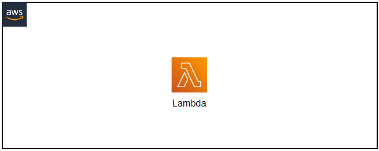

# Welcome to your CDK TypeScript project
This is a sample project built with the AWS CDK that provisions an AWS Lambda function with S3 list bucket permissions. When invoked, the lambda will log the buckets for the account to the console and return a 200 status code with message *Hello from the lambda*

The `cdk.json` file tells the CDK Toolkit how to execute your app.

## Useful commands

* `npm run build`   compile typescript to js
* `npm run watch`   watch for changes and compile
* `npm run test`    perform the jest unit tests
* `cdk deploy`      deploy this stack to your default AWS account/region
* `cdk diff`        compare deployed stack with current state
* `cdk synth`       emits the synthesized CloudFormation template
